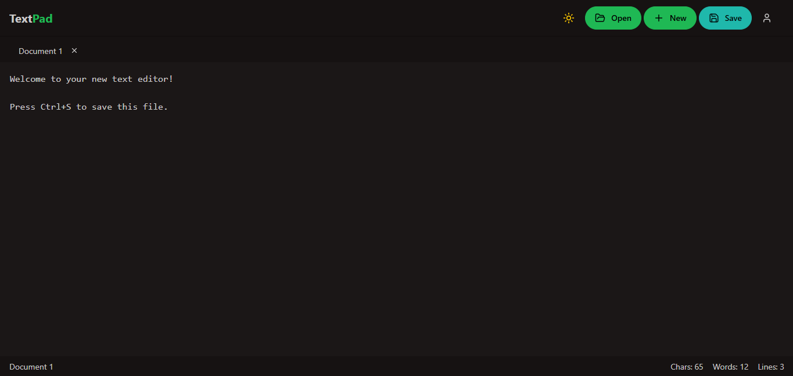

# Advanced Text Editor Application

 <!-- Add your screenshot here -->

A feature-rich text editor with cloud synchronization, local file management, and user authentication.

## Features

- **Dual Storage Options**
  - Save files locally (File System API or download)
  - Store files in cloud database
- **File Management**
  - Create, open, edit multiple documents in tabs
  - Import/export from local system
  - View and manage cloud-stored files
- **User Authentication**
  - Secure login/registration
  - Personalized file storage
- **Rich Editing Experience**
  - Syntax highlighting
  - Dark/light mode
  - Document statistics (word count, characters, lines)
- **Keyboard Shortcuts**
  - Ctrl+S to save
  - Ctrl+N for new tab

## Technologies Used

- **Frontend**
  - React + TypeScript
  - DaisyUI/TailwindCSS
  - Lucide React icons
- **Backend**
  - Node.js + Express
  - MongoDB + Mongoose
  - JWT Authentication
- **APIs**
  - File System Access API
  - Custom REST API for cloud storage

## Installation

### Prerequisites
- Node.js (v16+)
- MongoDB (v5+)
- Git

### Backend Setup
1. Clone the repository:
   ```bash
   git clone https://github.com/abdurrahmanabid/your-text-pad.git
   cd text-editor/server
   ```
2. Install dependencies:
   ```bash
   npm install
   ```
3. Create a `.env` file:
   ```env
   MONGODB_URI=mongodb://localhost:27017/text-editor
   JWT_SECRET=your_secure_secret
   PORT=5000
   ```
4. Start the server:
   ```bash
   npm start
   ```

### Frontend Setup
1. Navigate to the client directory:
   ```bash
   cd ../client
   ```
2. Install dependencies:
   ```bash
   npm install
   ```
3. Start the development server:
   ```bash
   npm run dev
   ```

## Usage

### Basic Operations
- **New Document**: Click "+ New" or use Ctrl+N
- **Open Files**:
  - Local files: "Open → From Local File"
  - Cloud files: "Open → From Database"
- **Save Files**:
  - Local save: "Save → To Local File"
  - Cloud save: "Save → To Database"
- **Manage Tabs**:
  - Click to switch tabs
  - Double-click tab names to rename
  - Click "×" to close tabs

### File Management
1. **View Cloud Files**:
   - Click "Open → From Database"
   - Browse your stored files
2. **Delete Files**:
   - Hover over a file in the cloud storage view
   - Click the trash icon to delete

### User Account
- Click your profile icon to:
  - View account details
  - Access settings
  - Logout

## API Endpoints

| Endpoint | Method | Description |
|----------|--------|-------------|
| `/api/register` | POST | User registration |
| `/api/login` | POST | User login |
| `/api/me` | GET | Get current user |
| `/api/files` | GET | Get user's files |
| `/api/files` | POST | Save file to cloud |
| `/api/files/:id` | DELETE | Delete file |

## Project Structure

```
text-editor/
├── client/                 # Frontend React application
│   ├── src/
│   │   ├── components/     # Reusable UI components
│   │   ├── pages/          # Application pages
│   │   ├── services/       # API service functions
│   │   └── App.tsx         # Main application
├── server/                 # Backend server
│   ├── models/             # MongoDB models
│   ├── routes/             # API routes
│   └── server.js           # Server entry point
└── README.md               # This file
```

## Contributing

1. Fork the project
2. Create your feature branch (`git checkout -b feature/AmazingFeature`)
3. Commit your changes (`git commit -m 'Add some amazing feature'`)
4. Push to the branch (`git push origin feature/AmazingFeature`)
5. Open a Pull Request

## License

Distributed under the MIT License. See `LICENSE` for more information.

## Contact

Abdur Rahman - abdurrahmanabid33@gmail.com

Project Link: [https://github.com/abdurrahmanabid/your-text-pad](https://github.com/abdurrahmanabid/your-text-pad)

Live Link: [https://yourtextpad.vercel.app/](https://yourtextpad.vercel.app/)
### Key Sections Included:

1. **Project Overview**: Brief description and screenshot
2. **Features**: Detailed feature list
3. **Tech Stack**: Technologies used
4. **Installation**: Step-by-step setup instructions
5. **Usage**: How to use the application
6. **API Documentation**: Available endpoints
7. **Project Structure**: Directory overview
8. **Contribution Guidelines**: How to contribute
9. **License & Contact**: Legal and contact info
